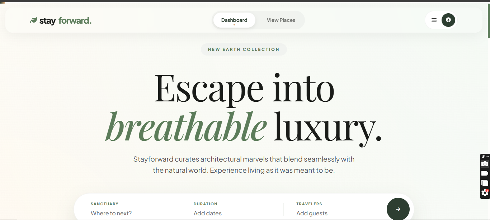
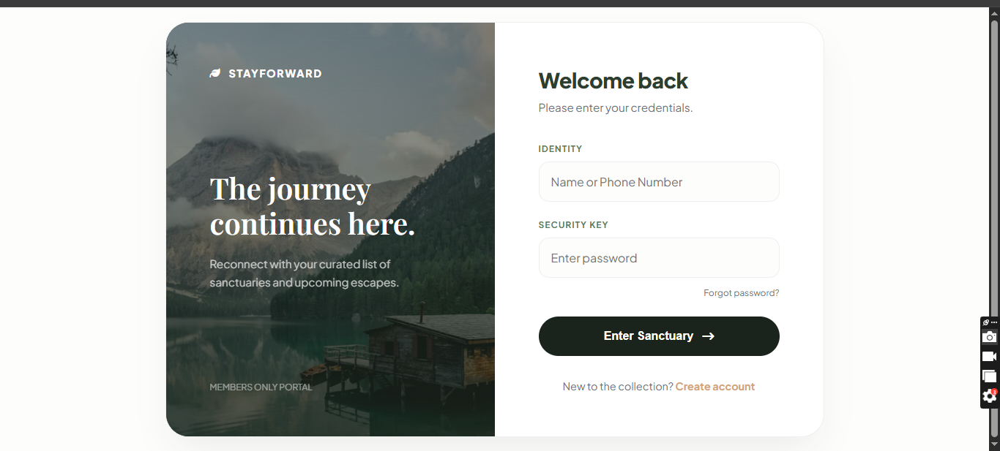
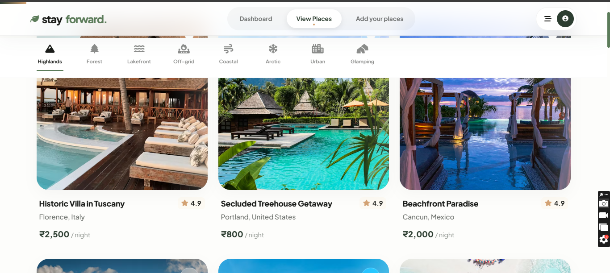
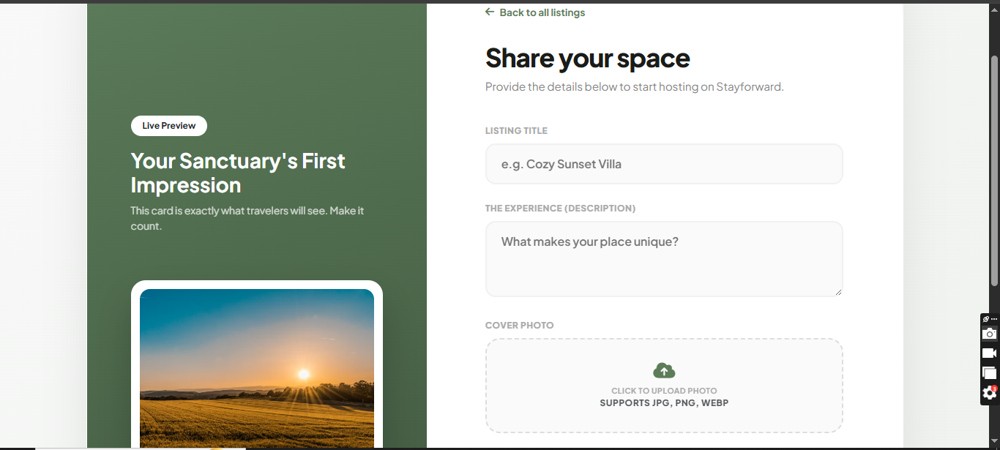
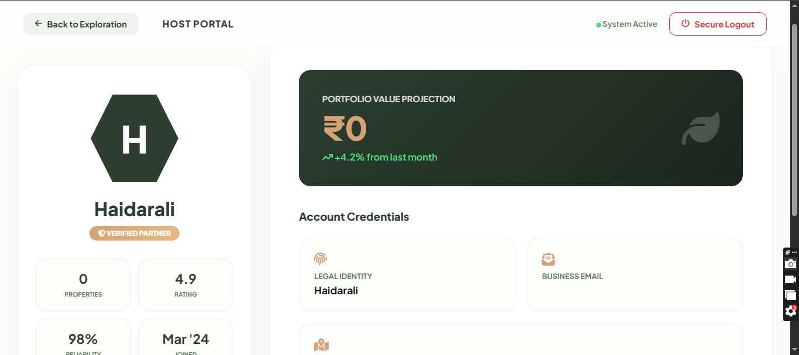
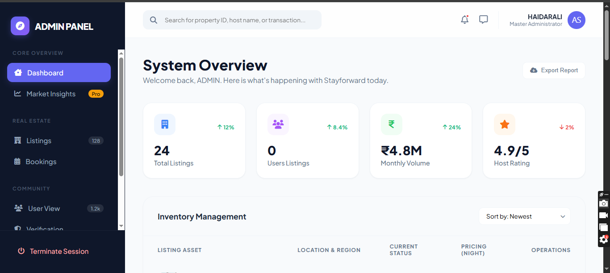
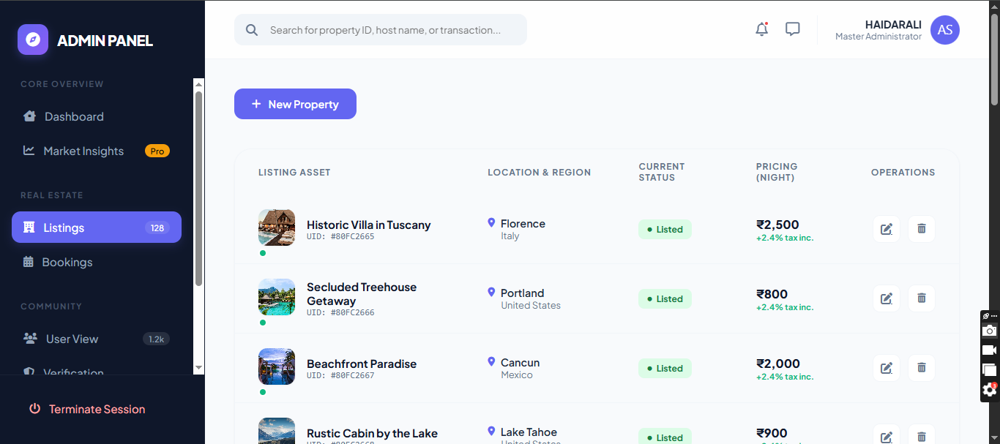
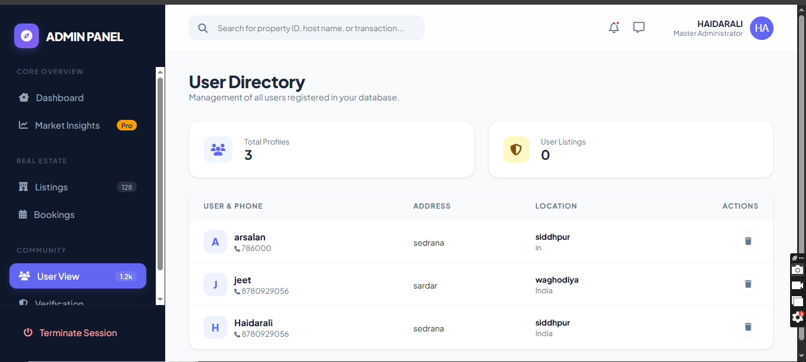

🏨 StayFound: Vacation Rentals & Accommodation Platform
A secure and intuitive Vacation Rental & Accommodation Platform built with the MEN Stack (MongoDB, Express, Node.js). It features strict route protection, user role management, and stateful session tracking to deliver a seamless booking experience.

✨ Key Features by Role
👑 Admin:-
      Global Moderation: Review, approve, or delete any property listing to maintain platform safety.
      User Management: View, update, or suspend user, host, and guest accounts.
      Platform Insights: Track global metrics like total active listings, users, and overall bookings.

🏠 Host (Property Owner):-
      Listing Control: Create, edit, or hide property profiles (pricing, images, amenities).
      Booking Management: Approve, decline, or track incoming guest reservation requests.
      Reputation Tracking: Monitor customer feedback and respond to guest reviews.

🧳 Guest (Traveler):-
      Smart Search: Filter and discover unique accommodations by location, price, and type.
      Secure Booking: Seamlessly reserve stays and track personal reservation histories.
      Verified Reviews: Share star ratings and text feedback after completing a stay.

🛠️ Backend & Architecture Highlights:-
Security Middleware: A centralized "digital bouncer" intercepts sensitive routes, blocking unauthenticated users from making unauthorized database changes.
Persistent Sessions: Uses express-session to securely remember logged-in users as they navigate between pages.
Strict Data Isolation: Links listings directly to a specific Host ID via Mongoose, ensuring users can only edit or delete their own data.
High Performance: Implements async/await patterns to keep database queries non-blocking, ensuring fast server response times.
Modular Clean Code: Organized into Express routers and reusable EJS front-end components to keep the codebase highly maintainable.

🧰 Tech Stack

Frontend: HTML5, CSS3, JavaScript, EJS Templates
Backend: Node.js, Express.js
Database: MongoDB, Mongoose (ODM)
Security: Express-Session, Custom Auth Middleware

--------------------------------------------------------------------------------------------------------------------------

<table width="100%">
  <tr>
    <td width="50%" align="center">
      <h3>User View</h3>
      
    </td>
    <td width="50%" align="center">
      <h3>Login Page</h3>
      
    </td>
  </tr>
  <tr>
    <td width="50%" align="center">
      <h3>Listings</h3>
      
    </td>
    <td width="50%" align="center">
      <h3>User List Places</h3>
      
    </td>
  </tr>
  <tr>
    <td width="50%" align="center">
      <h3>User Profile</h3>
      
    </td>
    <td width="50%" align="center">
      <h3>Admin Dashboard</h3>
      
    </td>
  </tr>
  <tr>
    <td width="50%" align="center">
      <h3>Admin sees all listings</h3>
      
    </td>
    <td width="50%" align="center">
      <h3>Admin Handle Users</h3>
      
    </td>
    
  </tr>
</table>

--------------------------------------------------------------------------------------------------------------------------
